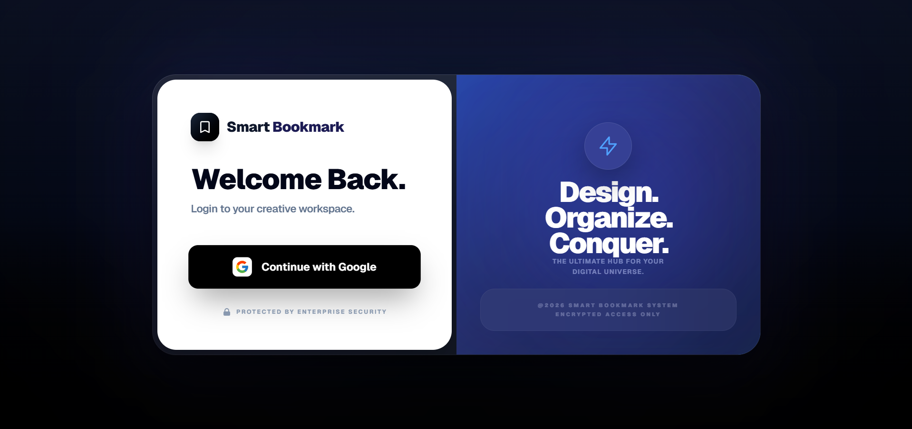
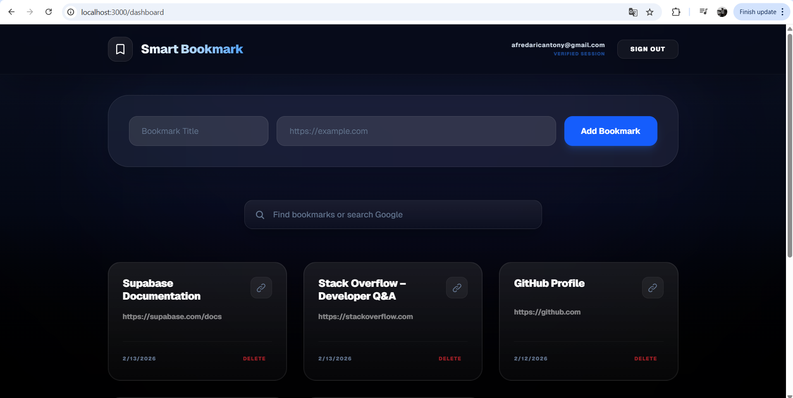

#  Smart Bookmark App

A premium, high-performance bookmark management system built with a modern Glass UI design.  
Secure, fast, and beautifully crafted for productivity.

---

##  Features

-  **Premium Glassmorphism UI** – Modern depth-based glass interface with smooth transitions
-  **Smart Search** – Real-time filtering with intelligent fallback search
-  **Card-wide Interaction** – Click anywhere on a bookmark card to open instantly
-  **Real-time Synchronization** – Powered by Supabase Realtime
-  **Secure Authentication (Google OAuth)** – Supabase Auth with Row Level Security (RLS)
-  **Toast Notification System** – Clean and elegant feedback system
-  **Fully Responsive** – Optimized for mobile, tablet, & desktop

---

## Tech Stack

- **Framework**: Next.js (App Router)
- **Styling**: Tailwind CSS
- **Database & Auth**: Supabase
- **Deployment**: Vercel
- **Icons**: Lucide Icons
- **Typography**: Space Grotesk / Inter

---

## Getting Started

### 1️⃣ Clone the repository

```bash
git clone https://github.com/AlenFredaric/smart-bookmark.git
cd smart-bookmark-app
```

### 2️⃣ Install dependencies

```bash
npm install
```

### 3️⃣ Environment Variables

Create a `.env.local` file in the root directory:

```env
NEXT_PUBLIC_SUPABASE_URL=your_supabase_url
NEXT_PUBLIC_SUPABASE_ANON_KEY=your_supabase_anon_key
```

### 4️⃣ Run the development server

```bash
npm run dev
```

Open:

```
http://localhost:3000
```

---

## Screenshots

### Login Page


### Dashboard


---

## Security

- Google OAuth authentication only
- Row Level Security (RLS) enabled
- Private bookmark storage per user

---


## Challenges & Solutions

### 1️⃣ Supabase OAuth Redirect Issues  
**Problem:** Google login worked locally but failed after deploying to Vercel due to redirect URL mismatch.  
**Solution:** Properly configured Supabase Authentication → URL Configuration with production Site URL and Redirect URLs.

---

### 2️⃣ Invalid Refresh Token Error  
**Problem:** Encountered `AuthApiError: Invalid Refresh Token: Refresh Token Not Found` during development.  
**Cause:** Expired or missing session cookies.  
**Solution:** Implemented proper session handling and cleared invalid tokens during re-authentication.

---

### 3️⃣ Real-time Sync Not Updating Across Tabs  
**Problem:** Bookmarks were not instantly updating across multiple browser tabs.  
**Solution:** Enabled Supabase Realtime replication and correctly subscribed to database changes.

---

### 4️⃣ Deployment Environment Variable Issues  
**Problem:** App worked locally but failed on production due to missing environment variables.  
**Solution:** Added required Supabase keys in Vercel Environment Variables and redeployed.

---

## Live Demo

 https://smart-bookmarks-project.vercel.app

---

## Author

**Alen Fredaric Francis**  
Full Stack Developer
